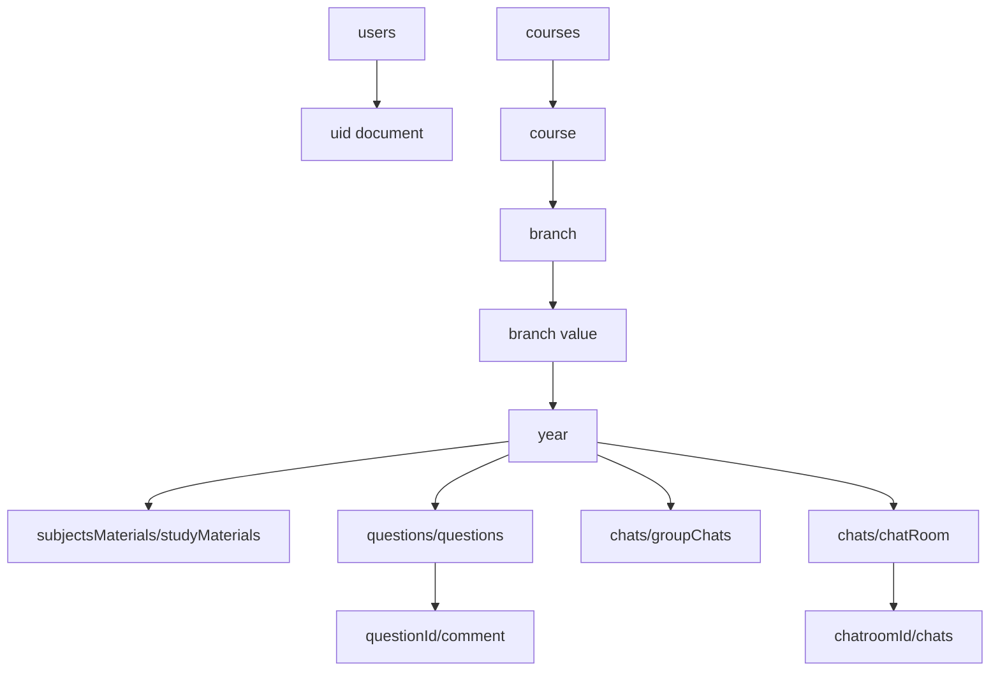

# Firestore Schema and Storage Paths

This doc explains where data is stored in Firebase.

## 1) Top-Level Collections

1. `users`
- Stores user profile docs keyed by uid.

2. `courses`
- Root for course/branch/year scoped academic content.

## 2) User Document (`users/{uid}`)

Fields from `UserDto`:
1. `id`
2. `name`
3. `email`
4. `contactNumber`
5. `college`
6. `course`
7. `branch`
8. `year`
9. `createdAt`

Reference:
- `lib/infrastructure/core/user_dtos.dart`

## 3) Course/Branch/Year Hierarchy

Base path pattern:

`courses/{course}/branch/{branch}/{year}/...`

Inside this branch-year node:

1. Subject materials
- `subjectsMaterials/studyMaterials/{subjectDoc}`

2. Questions
- `questions/questions/{questionId}`

3. Comments for question
- `questions/questions/{questionId}/comment/{commentId}`

4. Group chat messages
- `chats/groupChats/{messageId}`

5. Personal chat room metadata
- `chats/chatRoom/{chatroomId}`

6. Personal chat messages
- `chats/chatRoom/{chatroomId}/chats/{messageId}`

Reference:
- `lib/infrastructure/core/firestore_helpers.dart`

## 4) Important Document Fields

Question doc (`QuestionDto`):
1. `questionId`
2. `userId`
3. `questionDescription`
4. `mediaUrl`
5. `askAt`

Comment doc (`UserCommentDto`):
1. `commentId`
2. `userId`
3. `commentDescription`
4. `commentAt`

Message doc (`MessageDto`):
1. `messageId`
2. `userId`
3. `messageDescription`
4. `messageAt`

Chatroom doc (`ChatroomDto`):
1. `chatroomId`
2. `partnerId`
3. `chatroomDescription`
4. `chatroomAt`
5. `usersId` (array of both participants)

## 5) Firebase Storage Path

Question images are uploaded under:

`questions/questionImage/questionImage_<file>.jpg`

The resulting download URL is saved to question `mediaUrl`.

Reference:
- `lib/infrastructure/e_learning/e_learning_repository.dart`

## 6) Schema Diagram

